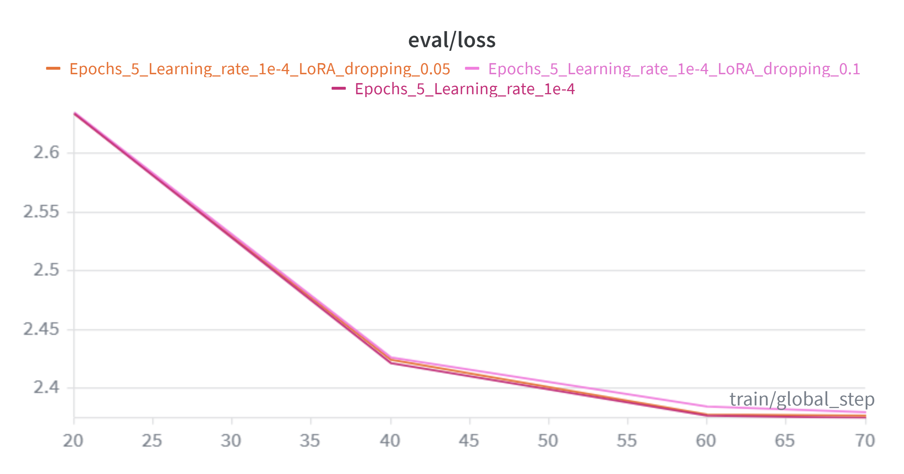
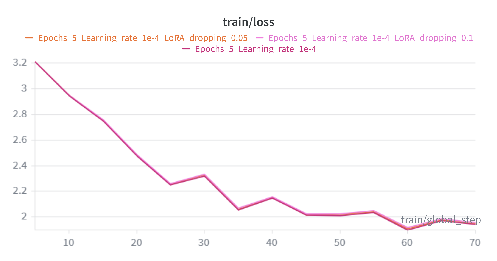
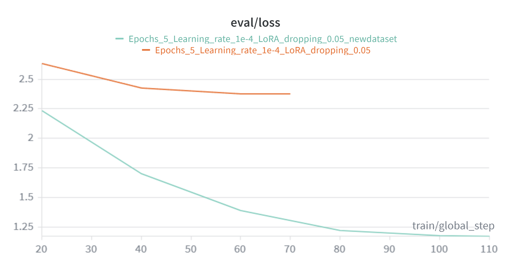
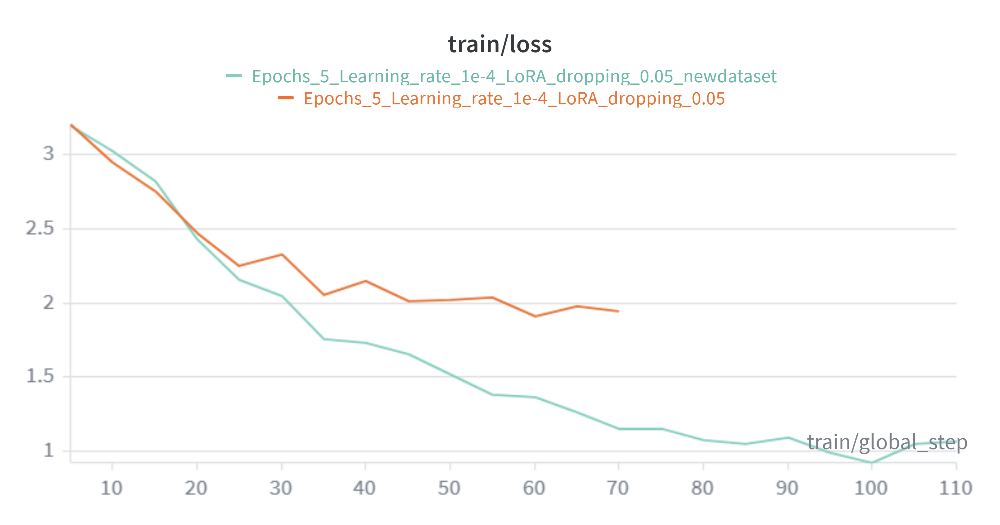

# 实验报告
这是我的深度学习课程实验报告：Style-Conditioned LoRA Fine-Tuning of Qwen2.5-0.5B-Instruct（基于风格条件的LoRA对Qwen2.5-0.5B-Instruct的微调）

## 一、数据集构建与处理
### 1.1 数据集的构建
- 我选择风格的原则：风格间需明显可区分，确保微调效果可观察
- 选择了3种风格：  
    | 类别 | 示例 |
    |------|------|
    | 古典/文学 | 文言文 |
    | 特殊语气 | 调皮童趣风格 |
    | 领域角色 | 新闻主播 |
- 构建数据集：采用大模型生成（DeepSeek，Chatgpt）
- 数据集：
    - [文言文数据（identity_wenyan.json）](/data/identity_wenyan.json) 
    - [调皮童趣风格数据（identity_Cantonese.jsonata）](/data/identity_playful_child.json)
    - [新闻主播风格数据（identity_news_anchor.jsonata）](/data/identity_news_anchor.json)
- 修改配置文件：[dataset_info.json#L5-L13](/data/dataset_info.json#L5-L13)

### 1.2 分析数据集
- 在进行微调对比实验时：4.5 数据集修改
- 问了ai，ai分析我的数据集不够好：
    - 当前数据集是identify_xxx，据覆盖面偏窄，容易训练成“身份问答风格化”，而不是稳定的通用风格助手。
    - 最好添加多类数据：
        1. 身份介绍
        2. 知识解释
        3. 日常聊天
        4. 写作任务
        5. 总结任务
        6. 安全拒答
        7. 情绪安慰
        8. 中英翻译
        9. 事实性问答
        10. 开放式观点
    - 使用ai生成

## 二、实验过程（使用llamafactory-cli指令）
- 使用的是魔搭社区的模型：`$env:USE_MODELSCOPE_HUB = "1"`
- 我的指令config里保存模型会保存在outputs文件夹，与webUI不一样
### 2.1 使用模型训练
- 我使用WebUI训练会报错，WebUI默认使用16核：preprocessing_num_workers: 16  
  因此我用llamafactory-cli指令运行：`llamafactory-cli train configs/qwen2.5_lora_sft.yaml`
- 训练配置：[configs/qwen2.5_lora_sft.yaml](configs/qwen2.5_lora_sft.yaml)
### 2.2 与lora微调模型对话验证
- 用llamafactory-cli指令运行：`llamafactory-cli chat configs/qwen2.5_lora_sft.yaml`
- 对话验证配置：[configs/qwen2.5_lora_infer.yaml](configs/qwen2.5_lora_infer.yaml)
### 2.3 与原始模型对话对比
- 用llamafactory-cli指令运行：`llamafactory-cli chat configs/qwen2.5_base_infer.yaml`
- 对话对比配置：[configs/qwen2.5_base_infer.yaml](configs/qwen2.5_base_infer.yaml)
### 2.4 损失曲线图
- 图中origin曲线在切换风格训练时会出现loss的反弹，但是整体的趋势smoothed曲线看loss是持续下降的：  
    

## 三、实验过程（使用webui配置）
- 运行指令打开UI界面：`conda activate llama` `llamafactory-cli webui`
- 修改runner.py配置的preprocessing_num_workers=2
### webui参数理解
- 最上面的部分是选择ui界面语言、模型、微调方法以及量化参数等。（使用Qwen2.5-0.5B-Instruct模型，不使用量化加速）  
    
- 中间的Train参数配置
      
    - Stage：训练阶段：选择训练方式（sft监督微调）
    - Dataset：数据集：选择要训练、微调的数据集
    - Learning rate：学习率：每次参数更新的幅度（学习率越大，学习越快，但是容易损失原模型能力）
    - Epochs：训练轮数：完整遍历训练集的次数
    - Maximum gradient norm：最大梯度范数：梯度裁剪阈值（防止梯度过大）
    - Max samples：最大样本数：每个数据集最多读取多少条（我的训练数据远小于该值，所以都使用）
    - Compute type：计算类型：模型训练使用的数值精度（Qwen2.5-0.5B-Instruct使用的是bf16）
    - Cutoff length：截断长度：每条样本最多保留的 token 数（我的数据比较短，建议使用短一点）
    - Batch size：批处理大小：每张 GPU 每次处理的样本数（训练一个批次用的数据量）
    - Gradient accumulation：梯度累积：累积多少个小批次后更新一次参数（相当于一次参数更新用到了 批处理大小*梯度累积 的数据）
    - Val size：验证集比例：从训练数据中划分多少作为验证集（设置验证集，训练时会绘制对应的验证loss，可以对比查看会不会过拟合等）
    - LR scheduler：学习率调节器：学习率随训练进程变化的方式
- 下方其它配置（需要修改的是其它参数设置以及LoRA参数设置）
    - 其它参数设置
    
        - logging_steps：记录loss的步数，用于绘制loss曲线
        - save_steps：checkpoint的间隔步数
        - warmup_steps：预热步数
        - neftune_noise_alpha：在训练期间给模型的输入词嵌入向量添加随机噪声，相当于一种正则化方法（先不设置）
        - 额外参数：{"optim": "adamw_torch"}-使用 PyTorch AdamW 优化器，合理且兼容性好
        - packing：序列打包-把多条短样本拼成一个固定长度序列（先关闭）
        - neat_packing：无污染打包-打包后阻止不同样本互相注意（先关闭）
        - train_on_prompt：学习提示词-是否对用户输入部分也计算损失（先关闭）
        - mask_history：不学习历史对话（我的数据集都是单轮对话）
        - resize_vocab：更改词表大小（先关闭）
        - use_llama_pro：训练新增/扩展的模型层（先关闭）
        - enable_thinking：启用思考（Qwen2.5-0.5B-Instruct，它不是标准思考模型,先关闭）
        - report_to：使用其它数据平台（我使用wandb）
        - Trackio Setting：也是数据平台（先关闭）
    - LoRA参数设置
    
        - lora_rank：rank 越大，LoRA 能学习的变化越复杂，但参数量、显存和过拟合风险也越高。
        - lora_alpha：LoRA 缩放系数，常设为 rank 的两倍 16
        - lora_dropout：防止小数据集过拟合，设为 0.05
        - LoRA+ 学习率比例：LoRA+ 会让 B 矩阵使用更高学习率。例如设为 16，B 矩阵学习率约为基础学习率的 16 倍。（先设置0）
        - 新建适配器：也就是resume，这里不选择
        - 其它参数，先不设置

## 四、训练超参数与曲线分析
### 4.1 在webui进行一系列的微调以及验证
- [Base配置文件：llamaboard_config/base.yaml](llamaboard_config/base.yaml)
- base为使用webui默认参数进行训练
- Epochs=3，对应的训练步数是：
    - 241条数据 * 0.9训练集比例 ≈ 217  
    - 217 /（2条GPU每次处理对话*8梯度累计）≈ 14
    - 14 * 3轮epochs = 42
- eval_loss：发现eval_loss是和save_steps相关，将保存步数设置为20，才能看清楚验证集的损失

### 4.2 Epochs-超参数修改
- 运行指令打开UI界面：`conda activate llama` `llamafactory-cli webui`
- 修改Epochs，验证Epochs对模型好坏的评判：
    - [Epochs配置文件：llamaboard_config/Epochs_3.yaml](llamaboard_config/base.yaml)
    - [Epochs配置文件：llamaboard_config/Epochs_5.yaml](llamaboard_config/Epochs_5.yaml)
    - [Epochs配置文件：llamaboard_config/Epochs_7.yaml](llamaboard_config/Epochs_7.yaml)
    - [Epochs配置文件：llamaboard_config/Epochs_9.yaml](llamaboard_config/Epochs_9.yaml)
    - [Epochs配置文件：llamaboard_config/Epochs_11.yaml](llamaboard_config/Epochs_11.yaml)
    - [Epochs配置文件：llamaboard_config/Epochs_13.yaml](llamaboard_config/Epochs_13.yaml)
    - 验证集和训练集的损失：
        |||
        |:---:|:---:|
        |验证集损失|训练集损失|
    - 取一个极端值epochs=30：可见训练集loss还在降低，验证集反而不好，过拟合
        |||
        |:---:|:---:|
        |验证集损失|训练集损失|
    - epochs=9、11、13时，训练集和验证集损失接近，后续只进行Epochs3、5、7

### 4.3 Learning rate-超参数修改
- 运行指令打开UI界面：`conda activate llama` `llamafactory-cli webui`
- 修改Learning_rate，验证Learning_rate对模型好坏的评判：
    - [Learning_rate配置文件：llamaboard_config/Base(Epochs_5_Learning_rate5e-5).yaml](llamaboard_config/Base(Epochs_5_Learning_rate5e-5).yaml)
    - [Learning_rate配置文件：llamaboard_config/Epochs_5_Learning_rate_1e-4.yaml](llamaboard_config/Epochs_5_Learning_rate_1e-4.yaml)
    - [Learning_rate配置文件：llamaboard_config/Epochs_5_Learning_rate_2e-4.yaml](llamaboard_config/Epochs_5_Learning_rate_2e-4.yaml)
    - [Learning_rate配置文件：llamaboard_config/Epochs_5_Learning_rate_3e-4.yaml](llamaboard_config/Epochs_5_Learning_rate_3e-4.yaml)
    - 验证集和训练集的损失：  
        可见当Epochs等于5时，Learning_rate设置2e-4验证集损失就几乎不变了，Learning_rate设置3e-4甚至变差。
        |||
        |:---:|:---:|
        |验证集损失|训练集损失|
    - 因为使用到了cosine学习调节器：可见越高的学习率能够实现越快的收敛，但是过高的学习率学习到后面会过拟合，效果更差。
        |||
        |:---:|:---:|
        |cosine学习调节器|learning rate|
    
### 4.4 LoRA dropping-超参数修改
- 运行指令打开UI界面：`conda activate llama` `llamafactory-cli webui`
- 修改LoRA dropping，验证LoRA dropping对模型好坏的评判：
    - [Learning_rate配置文件：llamaboard_config/Base(Epochs_5_Learning_rate_1e-4_LoRA_dropping_0).yaml](llamaboard_config/Epochs_5_Learning_rate_1e-4.yaml)
    - [Learning_rate配置文件：llamaboard_config/Epochs_5_Learning_rate_1e-4_LoRA_dropping_0.05.yaml](llamaboard_config/Epochs_5_Learning_rate_1e-4_LoRA_dropping_0.05.yaml)
    - [Learning_rate配置文件：llamaboard_config/Epochs_5_Learning_rate_1e-4_LoRA_dropping_0.1.yaml](llamaboard_config/Epochs_5_Learning_rate_1e-4_LoRA_dropping_0.1.yaml)
    - 训练集和验证集损失：发现差别不大，大概是因为我们的数据样本最长只有约 115 token，大多数样本很短。lora_dropout=0.05 只是在 LoRA 分支里随机丢 5% 的输入特征，扰动很小。
        |||
        |:---:|:---:|
        |验证集损失|训练集损失|

### 4.5 数据集修改
- 运行指令打开UI界面：`conda activate llama` `llamafactory-cli webui`
- 修改数据集，验证数据集对模型好坏的评判：
- 添加多类数据：
    1. 身份介绍
    2. 知识解释
    3. 日常聊天
    4. 写作任务
    5. 总结任务
    6. 安全拒答
    7. 情绪安慰
    8. 中英翻译
    9. 事实性问答
    10. 开放式观点
- loss确实降低了：
    |||
    |:---:|:---:|
    |验证集损失|训练集损失|

## 五、效果比较与案例学习
- 原模型对话结果：[origin_model.md](MY_README/my_chat_results/origin_model.md)
- Epochs不同，对话对比：[epochs_result.md](MY_README/my_chat_results/epochs_result.md)
- Learning rate不同，对话对比：[learning_rate_result.md](MY_README/my_chat_results/learning_rate_result.md)
- 数据集不同，对话对比：[newdatasets_result.md](MY_README/my_chat_results/newdatasets_result.md)
